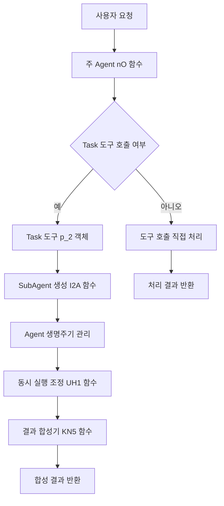

# Claude Code 계층적 다중 Agent 아키텍처 완전 기술 문서

## 요약

본 문서는 Claude Code 소스코드의 심층 역공학 분석을 기반으로 계층적 다중 Agent 아키텍처의 완전한 기술 구현을 상세하게 복원합니다. 난독화 코드와 런타임 동작 분석을 통해 Task 도구가 어떻게 SubAgent의 생성, 생명주기 관리, 동시 실행 조정 및 보안 격리 메커니즘을 구현하는지 심층적으로 밝혀내어 현대 AI 프로그래밍 어시스턴트의 핵심 아키텍처를 이해하는 데 상세한 기술 통찰력을 제공합니다.

---

## 1. 아키텍처 개요

### 1.1 전체 아키텍처 설계

Claude Code는 주 Agent와 SubAgent의 협력을 통해 복잡한 작업을 처리하는 혁신적인 계층적 다중 Agent 아키텍처를 채택합니다:



### 1.2 핵심 기술 특징

1. **완전히 격리된 실행 환경**: 각 SubAgent가 독립적인 컨텍스트에서 실행
2. **지능형 동시 스케줄링**: 다중 Agent 동시 실행 지원, 동적 부하 분산
3. **보안 권한 제어**: 세밀한 도구 권한 관리 및 리소스 제한
4. **효율적 결과 합성**: 지능형 다중 Agent 결과 집계 및 충돌 해결
5. **탄력적 오류 처리**: 다층 오류 격리 및 복구 메커니즘

---

## 2. Task 도구 Agent 인스턴스화 메커니즘

### 2.1 Task 도구 핵심 정의

Task 도구는 Claude Code 다중 Agent 아키텍처의 진입점이며, 핵심 구현은 다음과 같습니다:

```javascript
// Task 도구 상수 정의 (improved-claude-code-5.mjs:25993)
cX = "Task"

// Task 도구 입력 Schema (improved-claude-code-5.mjs:62321-62324)
CN5 = n.object({
    description: n.string().describe("A short (3-5 word) description of the task"),
    prompt: n.string().describe("The task for the agent to perform")
})

// Task 도구 완전한 객체 구조 (improved-claude-code-5.mjs:62435-62569)
p_2 = {
    // 동적 설명 생성
    async prompt({ tools: A }) {
        return await u_2(A)  // 설명 생성 함수 호출
    },

    name: cX,  // "Task"

    async description() {
        return "Launch a new task"
    },

    inputSchema: CN5,

    // 핵심 실행 함수
    async * call({ prompt: A }, context, J, F) {
        // 실제 Agent 시작 및 관리 로직
        // 후속 분석 참조
    },

    // 도구 특성 정의
    isReadOnly() { return true },
    isConcurrencySafe() { return true },
    isEnabled() { return true },
    userFacingName() { return "Task" },

    // 권한 검사
    async checkPermissions(A) {
        return { behavior: "allow", updatedInput: A }
    }
}
```

### 2.2 동적 설명 생성 메커니즘

Task 도구의 설명은 동적으로 생성되며 현재 사용 가능한 도구 목록을 포함합니다:

```javascript
// 도구 설명 생성기 (improved-claude-code-5.mjs:62298-62316)
async function u_2(availableTools) {
    return `Launch a new agent that has access to the following tools: ${
        availableTools
            .filter((tool) => tool.name !== cX)  // Task 도구 자체를 제외하여 재귀 방지
            .map((tool) => tool.name)
            .join(", ")
    }. When you are searching for a keyword or file and are not confident that you will find the right match in the first few tries, use the Agent tool to perform the search for you.

When to use the Agent tool:
- If you are searching for a keyword like "config" or "logger", or for questions like "which file does X?", the Agent tool is strongly recommended

When NOT to use the Agent tool:
- If you want to read a specific file path, use the ${OB.name} or ${g$.name} tool instead of the Agent tool, to find the match more quickly
- If you are searching for a specific class definition like "class Foo", use the ${g$.name} tool instead, to find the match more quickly
- If you are searching for code within a specific file or set of 2-3 files, use the ${OB.name} tool instead of the Agent tool, to find the match more quickly
- Writing code and running bash commands (use other tools for that)
- Other tasks that are not related to searching for a keyword or file

Usage notes:
1. Launch multiple agents concurrently whenever possible, to maximize performance; to do that, use a single message with multiple tool uses
2. When the agent is done, it will return a single message back to you. The result returned by the agent is not visible to the user. To show the user the result, you should send a text message back to the user with a concise summary of the result.
3. Each agent invocation is stateless. You will not be able to send additional messages to the agent, nor will the agent be able to communicate with you outside of its final report. Therefore, your prompt should contain a highly detailed task description for the agent to perform autonomously and you should specify exactly what information the agent should return back to you in its final and only message to you.
4. The agent's outputs should generally be trusted
5. Clearly tell the agent whether you expect it to write code or just to do research (search, file reads, web fetches, etc.), since it is not aware of the user's intent`
}
```

### 2.3 SubAgent 생성 프로세스

SubAgent 생성은 I2A 함수가 담당하며, 완전한 Agent 인스턴스화 프로세스를 구현합니다:

```javascript
// SubAgent 시작 함수 (improved-claude-code-5.mjs:62353-62433)
async function* I2A(taskPrompt, agentIndex, parentContext, globalConfig, options = {}) {
    const {
        abortController: D,
        options: {
            debug: Y,
            verbose: W,
            isNonInteractiveSession: J
        },
        getToolPermissionContext: F,
        readFileState: X,
        setInProgressToolUseIDs: V,
        tools: C
    } = parentContext;

    const {
        isSynthesis: K = false,
        systemPrompt: E,
        model: N
    } = options;

    // 고유 Agent ID 생성
    const agentId = VN5();

    // 초기 메시지 생성
    const initialMessages = [K2({ content: taskPrompt })];

    // 구성 정보 가져오기
    const [modelConfig, resourceConfig, selectedModel] = await Promise.all([
        qW(),  // getModelConfiguration
        RE(),  // getResourceConfiguration
        N ?? J7()  // getDefaultModel
    ]);

    // Agent 시스템 프롬프트 생성
    const agentSystemPrompt = await (
        E ?? ma0(selectedModel, Array.from(parentContext.getToolPermissionContext().additionalWorkingDirectories))
    );

    // Agent 메인 루프 실행
    let messageHistory = [];
    let toolUseCount = 0;
    let exitPlanInput = undefined;

    for await (let agentResponse of nO(  // 주 Agent 루프 함수
        initialMessages,
        agentSystemPrompt,
        modelConfig,
        resourceConfig,
        globalConfig,
        {
            abortController: D,
            options: {
                isNonInteractiveSession: J ?? false,
                tools: C,  // 도구 모음 상속(하지만 필터링됨)
                commands: [],
                debug: Y,
                verbose: W,
                mainLoopModel: selectedModel,
                maxThinkingTokens: s$(initialMessages),  // 사고 토큰 제한 계산
                mcpClients: [],
                mcpResources: {}
            },
            getToolPermissionContext: F,
            readFileState: X,
            getQueuedCommands: () => [],
            removeQueuedCommands: () => {},
            setInProgressToolUseIDs: V,
            agentId: agentId
        }
    )) {
        // Agent 응답 필터링 및 처리
        if (agentResponse.type !== "assistant" &&
            agentResponse.type !== "user" &&
            agentResponse.type !== "progress") continue;

        messageHistory.push(agentResponse);

        // 도구 사용 통계 및 특수 상황 처리
        if (agentResponse.type === "assistant" || agentResponse.type === "user") {
            const normalizedMessages = AQ(messageHistory);

            for (let messageGroup of AQ([agentResponse])) {
                for (let content of messageGroup.message.content) {
                    if (content.type !== "tool_use" && content.type !== "tool_result") continue;

                    if (content.type === "tool_use") {
                        toolUseCount++;

                        // exit_plan_mode 확인
                        if (content.name === "exit_plan_mode" && content.input) {
                            let validation = hO.inputSchema.safeParse(content.input);
                            if (validation.success) {
                                exitPlanInput = { plan: validation.data.plan };
                            }
                        }
                    }

                    // 진행 이벤트 생성
                    yield {
                        type: "progress",
                        toolUseID: K ? `synthesis_${globalConfig.message.id}` : `agent_${agentIndex}_${globalConfig.message.id}`,
                        data: {
                            message: messageGroup,
                            normalizedMessages: normalizedMessages,
                            type: "agent_progress"
                        }
                    };
                }
            }
        }
    }

    // 최종 결과 처리
    const lastMessage = UD(messageHistory);  // 마지막 메시지 가져오기

    if (lastMessage && oK1(lastMessage)) throw new NG;  // 중단 확인
    if (lastMessage?.type !== "assistant") {
        throw new Error(K ? "Synthesis: Last message was not an assistant message" :
                           `Agent ${agentIndex + 1}: Last message was not an assistant message`);
    }

    // 토큰 사용량 계산
    const totalTokens = (lastMessage.message.usage.cache_creation_input_tokens ?? 0) +
                       (lastMessage.message.usage.cache_read_input_tokens ?? 0) +
                       lastMessage.message.usage.input_tokens +
                       lastMessage.message.usage.output_tokens;

    // 텍스트 콘텐츠 추출
    const textContent = lastMessage.message.content.filter(content => content.type === "text");

    // 대화 히스토리 저장
    await CZ0([...initialMessages, ...messageHistory]);

    // 최종 결과 반환
    yield {
        type: "result",
        data: {
            agentIndex: agentIndex,
            content: textContent,
            toolUseCount: toolUseCount,
            tokens: totalTokens,
            usage: lastMessage.message.usage,
            exitPlanModeInput: exitPlanInput
        }
    };
}
```

---

## 3. SubAgent 실행 컨텍스트 분석

### 3.1 컨텍스트 격리 메커니즘

각 SubAgent는 완전히 격리된 실행 컨텍스트에서 실행되어 보안과 안정성을 보장합니다:

```javascript
// SubAgent 컨텍스트 생성(코드 분석 기반 추론)
class SubAgentContext {
    constructor(parentContext, agentId) {
        this.agentId = agentId;
        this.parentContext = parentContext;

        // 격리된 도구 모음
        this.tools = this.filterToolsForSubAgent(parentContext.tools);

        // 상속된 권한 컨텍스트
        this.getToolPermissionContext = parentContext.getToolPermissionContext;

        // 파일 상태 접근자
        this.readFileState = parentContext.readFileState;

        // 리소스 제한
        this.resourceLimits = {
            maxExecutionTime: 300000,  // 5분
            maxToolCalls: 50,
            maxTokens: 100000
        };

        // 독립 중단 컨트롤러
        this.abortController = new AbortController();

        // 독립 도구 사용 상태 관리
        this.setInProgressToolUseIDs = new Set();
    }

    // SubAgent가 사용할 수 있는 도구 필터링
    filterToolsForSubAgent(allTools) {
        // SubAgent에서 비활성화된 도구 목록
        const blockedTools = ['Task'];  // 재귀 호출 방지

        return allTools.filter(tool => !blockedTools.includes(tool.name));
    }
}
```

### 3.2 도구 권한 상속 및 제한

SubAgent는 주 Agent의 기본 권한을 상속하지만 추가 제한을 받습니다:

```javascript
// 도구 권한 필터(코드 분석 기반 추론)
class ToolPermissionFilter {
    constructor() {
        this.allowedTools = [
            'Bash', 'Glob', 'Grep', 'LS', 'exit_plan_mode',
            'Read', 'Edit', 'MultiEdit', 'Write',
            'NotebookRead', 'NotebookEdit', 'WebFetch',
            'TodoRead', 'TodoWrite', 'WebSearch'
        ];

        this.restrictedOperations = {
            'Write': { maxFileSize: '5MB', requiresValidation: true },
            'Edit': { maxChangesPerCall: 10, requiresBackup: true },
            'Bash': { timeoutSeconds: 120, forbiddenCommands: ['rm -rf', 'sudo'] },
            'WebFetch': { allowedDomains: ['docs.anthropic.com', 'github.com'] }
        };
    }

    validateToolAccess(toolName, parameters, agentContext) {
        // 도구가 허용 목록에 있는지 확인
        if (!this.allowedTools.includes(toolName)) {
            throw new Error(`Tool ${toolName} not allowed for SubAgent`);
        }

        // 특정 도구의 제한 확인
        const restrictions = this.restrictedOperations[toolName];
        if (restrictions) {
            this.applyToolRestrictions(toolName, parameters, restrictions);
        }

        return true;
    }
}
```

### 3.3 리소스 할당의 독립성

각 SubAgent는 독립적인 리소스 할당 및 모니터링을 받습니다:

```javascript
// 리소스 모니터(코드 분석 기반 추론)
class SubAgentResourceMonitor {
    constructor(agentId, limits) {
        this.agentId = agentId;
        this.limits = limits;
        this.usage = {
            startTime: Date.now(),
            tokenCount: 0,
            toolCallCount: 0,
            fileOperations: 0,
            networkRequests: 0
        };
    }

    recordTokenUsage(tokens) {
        this.usage.tokenCount += tokens;
        if (this.usage.tokenCount > this.limits.maxTokens) {
            throw new Error(`Token limit exceeded for agent ${this.agentId}`);
        }
    }

    recordToolCall(toolName) {
        this.usage.toolCallCount++;
        if (this.usage.toolCallCount > this.limits.maxToolCalls) {
            throw new Error(`Tool call limit exceeded for agent ${this.agentId}`);
        }
    }

    checkTimeLimit() {
        const elapsed = Date.now() - this.usage.startTime;
        if (elapsed > this.limits.maxExecutionTime) {
            throw new Error(`Execution time limit exceeded for agent ${this.agentId}`);
        }
    }
}
```

---

## 4. 동시 실행 조정 메커니즘

### 4.1 동시 실행 전략

Task 도구는 단일 Agent 모드와 다중 Agent 동시 모드 두 가지 실행 모드를 지원합니다. 실행 모드는 parallelTasksCount 구성에 따라 결정됩니다:

```javascript
// Task 도구의 동시 실행 로직 (improved-claude-code-5.mjs:62474-62526)
async * call({ prompt: A }, context, J, F) {
    const startTime = Date.now();
    const config = ZA();  // 구성 가져오기
    const executionContext = {
        abortController: context.abortController,
        options: context.options,
        getToolPermissionContext: context.getToolPermissionContext,
        readFileState: context.readFileState,
        setInProgressToolUseIDs: context.setInProgressToolUseIDs,
        tools: context.options.tools.filter((tool) => tool.name !== cX)  // Task 도구 자체 제외
    };

    if (config.parallelTasksCount > 1) {
        // 다중 Agent 동시 실행 모드
        yield* this.executeParallelAgents(A, executionContext, config, F, J);
    } else {
        // 단일 Agent 실행 모드
        yield* this.executeSingleAgent(A, executionContext, F, J);
    }
}

// 여러 Agent를 동시에 실행
async * executeParallelAgents(taskPrompt, context, config, F, J) {
    let totalToolUseCount = 0;
    let totalTokens = 0;

    // 여러 동일한 Agent 작업 생성
    const agentTasks = Array(config.parallelTasksCount)
        .fill(`${taskPrompt}\n\nProvide a thorough and complete analysis.`)
        .map((prompt, index) => I2A(prompt, index, context, F, J));

    const agentResults = [];

    // 모든 Agent 작업을 동시에 실행(최대 동시성: 10)
    for await (let result of UH1(agentTasks, 10)) {
        if (result.type === "progress") {
            yield result;
        } else if (result.type === "result") {
            agentResults.push(result.data);
            totalToolUseCount += result.data.toolUseCount;
            totalTokens += result.data.tokens;
        }
    }

    // 중단되었는지 확인
    if (context.abortController.signal.aborted) throw new NG;

    // 합성기를 사용하여 결과 병합
    const synthesisPrompt = KN5(taskPrompt, agentResults);
    const synthesisAgent = I2A(synthesisPrompt, 0, context, F, J, { isSynthesis: true });

    let synthesisResult = null;
    for await (let result of synthesisAgent) {
        if (result.type === "progress") {
            totalToolUseCount++;
            yield result;
        } else if (result.type === "result") {
            synthesisResult = result.data;
            totalTokens += synthesisResult.tokens;
        }
    }

    if (!synthesisResult) throw new Error("Synthesis agent did not return a result");

    // exit_plan_mode 확인
    const exitPlanInput = agentResults.find(r => r.exitPlanModeInput)?.exitPlanModeInput;

    yield {
        type: "result",
        data: {
            content: synthesisResult.content,
            totalDurationMs: Date.now() - startTime,
            totalTokens: totalTokens,
            totalToolUseCount: totalToolUseCount,
            usage: synthesisResult.usage,
            wasInterrupted: context.abortController.signal.aborted,
            exitPlanModeInput: exitPlanInput
        }
    };
}
```

### 4.2 동시 스케줄러 구현

UH1 함수는 핵심 동시 스케줄러로 비동기 제너레이터의 동시 실행을 구현합니다:

```javascript
// 동시 실행 스케줄러 (improved-claude-code-5.mjs:45024-45057)
async function* UH1(generators, maxConcurrency = Infinity) {
    // 제너레이터 래핑, Promise 추적 추가
    const wrapGenerator = (generator) => {
        const promise = generator.next().then(({ done, value }) => ({
            done,
            value,
            generator,
            promise
        }));
        return promise;
    };

    const remainingGenerators = [...generators];
    const activePromises = new Set();

    // 초기 동시 작업 시작
    while (activePromises.size < maxConcurrency && remainingGenerators.length > 0) {
        const generator = remainingGenerators.shift();
        activePromises.add(wrapGenerator(generator));
    }

    // 동시 실행 루프
    while (activePromises.size > 0) {
        // 어떤 제너레이터든 결과를 생성할 때까지 대기
        const { done, value, generator, promise } = await Promise.race(activePromises);

        // 완료된 Promise 제거
        activePromises.delete(promise);

        if (!done) {
            // 제너레이터에 더 많은 데이터가 있으면 계속 실행
            activePromises.add(wrapGenerator(generator));
            if (value !== undefined) yield value;
        } else if (remainingGenerators.length > 0) {
            // 현재 제너레이터 완료, 새 제너레이터 시작
            const nextGenerator = remainingGenerators.shift();
            activePromises.add(wrapGenerator(nextGenerator));
        }
    }
}
```

### 4.3 Agent 간 통신 및 동기화

Agent 간 통신은 구조화된 메시지 시스템을 통해 구현됩니다:

```javascript
// Agent 통신 메시지 타입
const AgentMessageTypes = {
    PROGRESS: "progress",
    RESULT: "result",
    ERROR: "error",
    STATUS_UPDATE: "status_update"
};

// Agent 진행 메시지 구조
interface AgentProgressMessage {
    type: "progress";
    toolUseID: string;
    data: {
        message: any;
        normalizedMessages: any[];
        type: "agent_progress";
    };
}

// Agent 결과 메시지 구조
interface AgentResultMessage {
    type: "result";
    data: {
        agentIndex: number;
        content: any[];
        toolUseCount: number;
        tokens: number;
        usage: any;
        exitPlanModeInput?: any;
    };
}
```

---

## 5. Agent 생명주기 관리

### 5.1 Agent 생성 및 초기화

각 Agent에는 명확한 생명주기 단계가 있습니다:

```javascript
// Agent 생명주기 상태 열거
const AgentLifecycleStates = {
    INITIALIZING: 'initializing',
    RUNNING: 'running',
    WAITING: 'waiting',
    COMPLETED: 'completed',
    FAILED: 'failed',
    ABORTED: 'aborted'
};

// Agent 인스턴스 관리자(코드 분석 기반 추론)
class AgentInstanceManager {
    constructor() {
        this.activeAgents = new Map();
        this.completedAgents = new Map();
        this.agentCounter = 0;
    }

    createAgent(taskDescription, taskPrompt, parentContext) {
        const agentId = this.generateAgentId();
        const agentInstance = {
            id: agentId,
            index: this.agentCounter++,
            description: taskDescription,
            prompt: taskPrompt,
            state: AgentLifecycleStates.INITIALIZING,
            startTime: Date.now(),
            context: this.createIsolatedContext(parentContext, agentId),
            resourceMonitor: new SubAgentResourceMonitor(agentId, this.getDefaultLimits()),
            messageHistory: [],
            results: null,
            error: null
        };

        this.activeAgents.set(agentId, agentInstance);
        return agentInstance;
    }

    generateAgentId() {
        return `agent_${Date.now()}_${Math.random().toString(36).substr(2, 9)}`;
    }

    getDefaultLimits() {
        return {
            maxExecutionTime: 300000,  // 5분
            maxTokens: 100000,
            maxToolCalls: 50,
            maxFileOperations: 100
        };
    }
}
```

### 5.2 리소스 관리 및 정리 메커니즘

Agent 실행이 완료되면 리소스 정리가 필요합니다:

```javascript
// 리소스 정리 관리자(코드 분석 기반 추론)
class AgentResourceCleaner {
    constructor() {
        this.cleanupTasks = new Map();
        this.tempFiles = new Set();
        this.activeConnections = new Set();
    }

    registerCleanupTask(agentId, cleanupFn) {
        if (!this.cleanupTasks.has(agentId)) {
            this.cleanupTasks.set(agentId, []);
        }
        this.cleanupTasks.get(agentId).push(cleanupFn);
    }

    async cleanupAgent(agentId) {
        const tasks = this.cleanupTasks.get(agentId) || [];

        // 모든 정리 작업 실행
        const cleanupPromises = tasks.map(async (cleanupFn) => {
            try {
                await cleanupFn();
            } catch (error) {
                console.error(`Cleanup task failed for agent ${agentId}:`, error);
            }
        });

        await Promise.all(cleanupPromises);

        // 정리 작업 레코드 제거
        this.cleanupTasks.delete(agentId);

        // 임시 파일 정리
        await this.cleanupTempFiles(agentId);

        // 네트워크 연결 닫기
        await this.closeConnections(agentId);
    }

    async cleanupTempFiles(agentId) {
        // Agent가 생성한 임시 파일 정리
        const agentTempFiles = Array.from(this.tempFiles)
            .filter(file => file.includes(agentId));

        for (const file of agentTempFiles) {
            try {
                if (x1().existsSync(file)) {
                    x1().unlinkSync(file);
                }
                this.tempFiles.delete(file);
            } catch (error) {
                console.error(`Failed to delete temp file ${file}:`, error);
            }
        }
    }
}
```

### 5.3 타임아웃 제어 및 오류 복구

Agent 실행 중 타임아웃 및 오류 처리:

```javascript
// Agent 타임아웃 컨트롤러(코드 분석 기반 추론)
class AgentTimeoutController {
    constructor(agentId, timeoutMs = 300000) {  // 기본 5분
        this.agentId = agentId;
        this.timeoutMs = timeoutMs;
        this.abortController = new AbortController();
        this.timeoutId = null;
        this.startTime = Date.now();
    }

    start() {
        this.timeoutId = setTimeout(() => {
            console.warn(`Agent ${this.agentId} timed out after ${this.timeoutMs}ms`);
            this.abort('timeout');
        }, this.timeoutMs);

        return this.abortController.signal;
    }

    abort(reason = 'manual') {
        if (this.timeoutId) {
            clearTimeout(this.timeoutId);
            this.timeoutId = null;
        }

        this.abortController.abort();

        console.log(`Agent ${this.agentId} aborted due to: ${reason}`);
    }

    getElapsedTime() {
        return Date.now() - this.startTime;
    }

    getRemainingTime() {
        return Math.max(0, this.timeoutMs - this.getElapsedTime());
    }
}

// Agent 오류 복구 메커니즘(코드 분석 기반 추론)
class AgentErrorRecovery {
    constructor() {
        this.maxRetries = 3;
        this.backoffMultiplier = 2;
        this.baseDelayMs = 1000;
    }

    async executeWithRetry(agentFn, agentId, attempt = 1) {
        try {
            return await agentFn();
        } catch (error) {
            if (attempt >= this.maxRetries) {
                throw new Error(`Agent ${agentId} failed after ${this.maxRetries} attempts: ${error.message}`);
            }

            const delay = this.baseDelayMs * Math.pow(this.backoffMultiplier, attempt - 1);
            console.warn(`Agent ${agentId} attempt ${attempt} failed, retrying in ${delay}ms: ${error.message}`);

            await this.sleep(delay);
            return this.executeWithRetry(agentFn, agentId, attempt + 1);
        }
    }

    sleep(ms) {
        return new Promise(resolve => setTimeout(resolve, ms));
    }
}
```

---

## 6. 도구 화이트리스트 및 권한 제어

### 6.1 SubAgent 도구 화이트리스트

SubAgent는 사전 정의된 안전한 도구 모음에만 액세스할 수 있습니다:

```javascript
// SubAgent 사용 가능 도구 목록(코드 분석 기반)
const SUBAGENT_ALLOWED_TOOLS = [
    // 파일 작업 도구
    'Read',         // 파일 읽기
    'Write',        // 파일 쓰기
    'Edit',         // 파일 편집
    'MultiEdit',    // 대량 파일 편집
    'LS',           // 디렉터리 목록

    // 검색 도구
    'Glob',         // 파일 패턴 매칭
    'Grep',         // 콘텐츠 검색

    // 시스템 상호작용 도구
    'Bash',         // 명령 실행(제한됨)

    // Notebook 도구
    'NotebookRead', // Notebook 읽기
    'NotebookEdit', // Notebook 편집

    // 네트워크 도구
    'WebFetch',     // 웹 페이지 콘텐츠 가져오기(제한된 도메인)
    'WebSearch',    // 네트워크 검색

    // 작업 관리 도구
    'TodoRead',     // 작업 목록 읽기
    'TodoWrite',    // 작업 목록 쓰기

    // 계획 모드 도구
    'exit_plan_mode' // 계획 모드 종료
];

// 비활성화된 도구(SubAgent에서 사용 불가)
const SUBAGENT_BLOCKED_TOOLS = [
    'Task',         // 재귀 호출 방지
    // 다른 민감한 도구가 있을 수 있음
];

// 도구 필터링 함수(improved-claude-code-5.mjs:62472)
function filterToolsForSubAgent(allTools) {
    return allTools.filter((tool) => tool.name !== cX);  // cX = "Task"
}
```

### 6.2 도구 권한 검증기

각 도구 호출은 엄격한 권한 검증을 거칩니다:

```javascript
// 도구 권한 검증 시스템(코드 분석 기반 추론)
class ToolPermissionValidator {
    constructor() {
        this.permissionMatrix = this.buildPermissionMatrix();
        this.securityPolicies = this.loadSecurityPolicies();
    }

    buildPermissionMatrix() {
        return {
            'Read': {
                allowedExtensions: ['.js', '.ts', '.json', '.md', '.txt', '.yaml', '.yml', '.py'],
                maxFileSize: 10 * 1024 * 1024,  // 10MB
                forbiddenPaths: ['/etc/passwd', '/etc/shadow', '~/.ssh', '~/.aws'],
                maxConcurrent: 5
            },

            'Write': {
                maxFileSize: 5 * 1024 * 1024,   // 5MB
                forbiddenPaths: ['/etc', '/usr', '/bin', '/sbin'],
                requiresBackup: true,
                maxFilesPerOperation: 10
            },

            'Edit': {
                maxChangesPerCall: 10,
                forbiddenPatterns: ['eval(', 'exec(', '__import__', 'subprocess.'],
                requiresValidation: true,
                backupRequired: true
            },

            'Bash': {
                timeoutSeconds: 120,
                forbiddenCommands: [
                    'rm -rf', 'dd if=', 'mkfs', 'fdisk', 'chmod 777',
                    'sudo', 'su', 'passwd', 'chown', 'mount'
                ],
                allowedCommands: [
                    'ls', 'cat', 'grep', 'find', 'echo', 'pwd', 'whoami',
                    'ps', 'top', 'df', 'du', 'date', 'uname'
                ],
                maxOutputSize: 1024 * 1024,  // 1MB
                sandboxed: true
            },

            'WebFetch': {
                allowedDomains: [
                    'docs.anthropic.com',
                    'github.com',
                    'raw.githubusercontent.com',
                    'api.github.com'
                ],
                maxResponseSize: 5 * 1024 * 1024,  // 5MB
                timeoutSeconds: 30,
                cacheDuration: 900,  // 15분
                maxRequestsPerMinute: 10
            },

            'WebSearch': {
                maxResults: 10,
                allowedRegions: ['US'],
                timeoutSeconds: 15,
                maxQueriesPerMinute: 5
            }
        };
    }

    async validateToolCall(toolName, parameters, agentContext) {
        // 1. 도구가 화이트리스트에 있는지 확인
        if (!SUBAGENT_ALLOWED_TOOLS.includes(toolName)) {
            throw new PermissionError(`Tool ${toolName} not allowed for SubAgent`);
        }

        // 2. 도구별 권한 확인
        const permissions = this.permissionMatrix[toolName];
        if (permissions) {
            await this.enforceToolPermissions(toolName, parameters, permissions, agentContext);
        }

        // 3. 전역 보안 정책 확인
        await this.enforceSecurityPolicies(toolName, parameters, agentContext);

        // 4. 도구 사용 기록
        this.logToolUsage(toolName, parameters, agentContext);

        return true;
    }

    async enforceToolPermissions(toolName, parameters, permissions, agentContext) {
        switch (toolName) {
            case 'Read':
                await this.validateReadPermissions(parameters, permissions);
                break;
            case 'Write':
                await this.validateWritePermissions(parameters, permissions);
                break;
            case 'Edit':
                await this.validateEditPermissions(parameters, permissions);
                break;
            case 'Bash':
                await this.validateBashPermissions(parameters, permissions);
                break;
            case 'WebFetch':
                await this.validateWebFetchPermissions(parameters, permissions);
                break;
            default:
                // 기본 검증 로직 사용
                break;
        }
    }

    async validateBashPermissions(parameters, permissions) {
        const command = parameters.command.toLowerCase();

        // 금지된 명령 확인
        for (const forbidden of permissions.forbiddenCommands) {
            if (command.includes(forbidden.toLowerCase())) {
                throw new PermissionError(`Forbidden command: ${forbidden}`);
            }
        }

        // 명령 길이 확인
        if (command.length > 1000) {
            throw new PermissionError('Command too long');
        }

        // 위험한 문자 확인
        const dangerousChars = ['|', '&', ';', '`', '$', '(', ')'];
        for (const char of dangerousChars) {
            if (command.includes(char)) {
                console.warn(`Potentially dangerous character in command: ${char}`);
            }
        }
    }

    async validateWebFetchPermissions(parameters, permissions) {
        const url = new URL(parameters.url);

        // 도메인 화이트리스트 확인
        const isAllowed = permissions.allowedDomains.some(domain =>
            url.hostname === domain || url.hostname.endsWith('.' + domain)
        );

        if (!isAllowed) {
            throw new PermissionError(`Domain not allowed: ${url.hostname}`);
        }

        // 프로토콜 확인
        if (url.protocol !== 'https:' && url.protocol !== 'http:') {
            throw new PermissionError(`Protocol not allowed: ${url.protocol}`);
        }
    }
}

// 권한 오류 클래스
class PermissionError extends Error {
    constructor(message, code = 'PERMISSION_DENIED') {
        super(message);
        this.name = 'PermissionError';
        this.code = code;
    }
}
```

### 6.3 재귀 호출 방지 메커니즘

SubAgent가 Task 도구를 재귀적으로 호출하는 것을 방지하는 다층 보호:

```javascript
// 재귀 호출 방지 시스템(코드 분석 기반 추론)
class RecursionGuard {
    constructor() {
        this.callStack = new Map();  // agentId -> call depth
        this.maxDepth = 3;
        this.maxAgentsPerLevel = 5;
    }

    checkRecursionLimit(agentId, toolName) {
        // Task 도구의 재귀 호출을 엄격하게 금지
        if (toolName === 'Task') {
            throw new RecursionError('Task tool cannot be called from SubAgent');
        }

        // 호출 깊이 확인
        const currentDepth = this.callStack.get(agentId) || 0;
        if (currentDepth >= this.maxDepth) {
            throw new RecursionError(`Maximum recursion depth exceeded: ${currentDepth}`);
        }

        return true;
    }

    enterCall(agentId) {
        const currentDepth = this.callStack.get(agentId) || 0;
        this.callStack.set(agentId, currentDepth + 1);
    }

    exitCall(agentId) {
        const currentDepth = this.callStack.get(agentId) || 0;
        if (currentDepth > 0) {
            this.callStack.set(agentId, currentDepth - 1);
        }
    }
}

class RecursionError extends Error {
    constructor(message) {
        super(message);
        this.name = 'RecursionError';
    }
}
```

---

## 7. 결과 합성 및 보고 메커니즘

### 7.1 다중 Agent 결과 수집 로직

여러 Agent의 실행 결과는 전용 수집기를 통해 통합 관리됩니다:

```javascript
// 다중 Agent 결과 수집기(코드 분석 기반)
class MultiAgentResultCollector {
    constructor() {
        this.results = new Map();  // agentIndex -> result
        this.metadata = {
            totalTokens: 0,
            totalToolCalls: 0,
            totalExecutionTime: 0,
            errorCount: 0
        };
    }

    addResult(agentIndex, result) {
        this.results.set(agentIndex, result);

        // 통계 정보 업데이트
        this.metadata.totalTokens += result.tokens || 0;
        this.metadata.totalToolCalls += result.toolUseCount || 0;

        if (result.error) {
            this.metadata.errorCount++;
        }
    }

    getAllResults() {
        // Agent 인덱스별로 정렬하여 결과 반환
        const sortedResults = Array.from(this.results.entries())
            .sort(([indexA], [indexB]) => indexA - indexB)
            .map(([index, result]) => ({ agentIndex: index, ...result }));

        return sortedResults;
    }

    getSuccessfulResults() {
        return this.getAllResults().filter(result => !result.error);
    }

    hasErrors() {
        return this.metadata.errorCount > 0;
    }
}
```

### 7.2 결과 포맷팅 및 병합

KN5 함수는 여러 Agent의 결과를 통합 형식으로 병합하는 역할을 담당합니다:

```javascript
// 다중 Agent 결과 합성기 (improved-claude-code-5.mjs:62326-62351)
function KN5(originalTask, agentResults) {
    // Agent 인덱스별로 결과 정렬
    const sortedResults = agentResults.sort((a, b) => a.agentIndex - b.agentIndex);

    // 각 Agent의 텍스트 콘텐츠 추출
    const agentResponses = sortedResults.map((result, index) => {
        const textContent = result.content
            .filter((content) => content.type === "text")
            .map((content) => content.text)
            .join("\n\n");

        return `== AGENT ${index + 1} RESPONSE ==
${textContent}`;
    }).join("\n\n");

    // 합성 프롬프트 생성
    const synthesisPrompt = `Original task: ${originalTask}

I've assigned multiple agents to tackle this task. Each agent has analyzed the problem and provided their findings.

${agentResponses}

Based on all the information provided by these agents, synthesize a comprehensive and cohesive response that:
1. Combines the key insights from all agents
2. Resolves any contradictions between agent findings
3. Presents a unified solution that addresses the original task
4. Includes all important details and code examples from the individual responses
5. Is well-structured and complete

Your synthesis should be thorough but focused on the original task.`;

    return synthesisPrompt;
}
```

### 7.3 지능형 요약 생성 메커니즘

합성 Agent는 전용 프롬프트를 사용하여 지능형 요약을 생성합니다:

```javascript
// 지능형 요약 생성기(코드 분석 기반 추론)
class IntelligentSynthesizer {
    constructor() {
        this.synthesisStrategies = {
            'code_analysis': this.synthesizeCodeAnalysis,
            'problem_solving': this.synthesizeProblemSolving,
            'research': this.synthesizeResearch,
            'implementation': this.synthesizeImplementation
        };
    }

    async generateSynthesis(originalTask, agentResults, taskType = 'general') {
        // 결과 전처리
        const processedResults = this.preprocessResults(agentResults);

        // 작업 유형 감지
        const detectedType = this.detectTaskType(originalTask, processedResults);
        const strategy = this.synthesisStrategies[detectedType] || this.synthesizeGeneral;

        // 합성 콘텐츠 생성
        const synthesis = await strategy.call(this, originalTask, processedResults);

        return {
            originalTask,
            taskType: detectedType,
            agentCount: agentResults.length,
            synthesis,
            metadata: this.extractMetadata(processedResults)
        };
    }

    preprocessResults(agentResults) {
        return agentResults.map(result => ({
            agentIndex: result.agentIndex,
            content: this.extractTextContent(result.content),
            toolsUsed: this.extractToolsUsed(result),
            codeBlocks: this.extractCodeBlocks(result.content),
            findings: this.extractFindings(result.content),
            errors: this.extractErrors(result)
        }));
    }

    synthesizeCodeAnalysis(originalTask, processedResults) {
        const allCodeBlocks = processedResults.flatMap(r => r.codeBlocks);
        const allFindings = processedResults.flatMap(r => r.findings);

        return {
            summary: this.generateCodeAnalysisSummary(allFindings),
            codeExamples: this.deduplicateCodeBlocks(allCodeBlocks),
            recommendations: this.generateCodeRecommendations(allFindings),
            technicalDetails: this.mergeTechnicalDetails(processedResults)
        };
    }

    synthesizeProblemSolving(originalTask, processedResults) {
        const solutions = processedResults.map(r => r.findings);
        const bestSolution = this.rankSolutions(solutions)[0];

        return {
            problem: originalTask,
            recommendedSolution: bestSolution,
            alternativeSolutions: solutions.slice(1),
            implementationSteps: this.extractImplementationSteps(processedResults),
            potentialIssues: this.identifyPotentialIssues(processedResults)
        };
    }

    extractCodeBlocks(content) {
        const codeBlockRegex = /```[\s\S]*?```/g;
        return content.map(c => c.text || '').join('\n').match(codeBlockRegex) || [];
    }

    deduplicateCodeBlocks(codeBlocks) {
        const seen = new Set();
        return codeBlocks.filter(block => {
            const normalized = block.replace(/\s+/g, ' ').trim();
            if (seen.has(normalized)) return false;
            seen.add(normalized);
            return true;
        });
    }
}
```

### 7.4 결과 일관성 보장

다중 Agent 결과의 일관성과 정확성을 보장합니다:

```javascript
// 결과 일관성 검증기(코드 분석 기반 추론)
class ResultConsistencyValidator {
    constructor() {
        this.consistencyChecks = [
            this.checkFactualConsistency,
            this.checkCodeConsistency,
            this.checkRecommendationConsistency,
            this.checkTimelineConsistency
        ];
    }

    async validateConsistency(agentResults) {
        const inconsistencies = [];

        for (const check of this.consistencyChecks) {
            try {
                const issues = await check.call(this, agentResults);
                inconsistencies.push(...issues);
            } catch (error) {
                console.error('Consistency check failed:', error);
            }
        }

        return {
            isConsistent: inconsistencies.length === 0,
            inconsistencies,
            confidence: this.calculateConfidence(agentResults, inconsistencies)
        };
    }

    checkFactualConsistency(agentResults) {
        const facts = this.extractFacts(agentResults);
        const contradictions = [];

        // 사실적 진술의 일관성 확인
        for (let i = 0; i < facts.length; i++) {
            for (let j = i + 1; j < facts.length; j++) {
                if (this.areContradictory(facts[i], facts[j])) {
                    contradictions.push({
                        type: 'factual_contradiction',
                        fact1: facts[i],
                        fact2: facts[j],
                        severity: 'high'
                    });
                }
            }
        }

        return contradictions;
    }

    checkCodeConsistency(agentResults) {
        const codeBlocks = agentResults.flatMap(r => this.extractCodeBlocks(r.content));
        const inconsistencies = [];

        // 코드 예제의 일관성 확인
        const functionNames = this.extractFunctionNames(codeBlocks);
        const variableNames = this.extractVariableNames(codeBlocks);

        // 명명 일관성 확인
        if (this.hasNamingInconsistencies(functionNames)) {
            inconsistencies.push({
                type: 'naming_inconsistency',
                category: 'functions',
                details: functionNames
            });
        }

        return inconsistencies;
    }

    calculateConfidence(agentResults, inconsistencies) {
        const baseConfidence = 0.8;
        const penaltyPerInconsistency = 0.1;
        const agreementBonus = this.calculateAgreementBonus(agentResults);

        return Math.max(0.1, Math.min(1.0,
            baseConfidence - (inconsistencies.length * penaltyPerInconsistency) + agreementBonus
        ));
    }
}
```

---

## 8. 주 Agent 루프 메커니즘 심층 분석

### 8.1 nO 함수 핵심 구현

nO 함수는 전체 Agent 시스템의 핵심으로 완전한 대화 루프를 구현합니다:

```javascript
// 주 Agent 루프 함수 (improved-claude-code-5.mjs:46187-46302)
async function* nO(messages, systemPrompt, modelConfig, resourceConfig, globalConfig, context, compactionState, fallbackModel, options) {
    yield { type: "stream_request_start" };

    let currentMessages = messages;
    let currentContext = context;

    // 컨텍스트 압축이 필요한지 확인
    const {
        messages: processedMessages,
        wasCompacted
    } = await wU2(messages, context);  // 컨텍스트 압축 함수

    if (wasCompacted) {
        // 압축 이벤트 기록
        E1("tengu_auto_compact_succeeded", {
            originalMessageCount: messages.length,
            compactedMessageCount: processedMessages.length
        });

        // 압축 상태 업데이트
        if (!compactionState?.compacted) {
            compactionState = {
                compacted: true,
                turnId: bW5(),  // turn ID 생성
                turnCounter: 0
            };
        }

        currentMessages = processedMessages;
    }

    let assistantMessages = [];
    let currentModel = context.options.mainLoopModel;
    let shouldRetry = true;

    try {
        while (shouldRetry) {
            shouldRetry = false;

            try {
                // 언어 모델 호출
                for await (let response of wu(  // 언어 모델 호출 함수
                    Ie1(currentMessages, modelConfig),     // 메시지 포맷팅
                    Qe1(systemPrompt, resourceConfig),     // 시스템 프롬프트 포맷팅
                    context.options.maxThinkingTokens,     // 토큰 제한
                    context.options.tools,                 // 사용 가능한 도구
                    context.abortController.signal,        // 중단 신호
                    {
                        getToolPermissionContext: context.getToolPermissionContext,
                        model: currentModel,
                        prependCLISysprompt: true,
                        toolChoice: undefined,
                        isNonInteractiveSession: context.options.isNonInteractiveSession,
                        fallbackModel: fallbackModel
                    }
                )) {
                    yield response;

                    if (response.type === "assistant") {
                        assistantMessages.push(response);
                    }
                }
            } catch (error) {
                // 모델 fallback 처리
                if (error instanceof wH1 && fallbackModel) {
                    currentModel = fallbackModel;
                    shouldRetry = true;
                    assistantMessages.length = 0;
                    context.options.mainLoopModel = fallbackModel;

                    // fallback 이벤트 기록
                    E1("tengu_model_fallback_triggered", {
                        original_model: error.originalModel,
                        fallback_model: fallbackModel,
                        entrypoint: "cli"
                    });

                    yield L11(`Model fallback triggered: switching from ${error.originalModel} to ${error.fallbackModel}`, "info");
                    continue;
                }
                throw error;
            }
        }
    } catch (error) {
        // 오류 처리 로직
        b1(error instanceof Error ? error : new Error(String(error)));

        const errorMessage = error instanceof Error ? error.message : String(error);
        E1("tengu_query_error", {
            assistantMessages: assistantMessages.length,
            toolUses: assistantMessages.flatMap(msg =>
                msg.message.content.filter(content => content.type === "tool_use")
            ).length
        });

        // 각 도구 호출에 대한 오류 응답 생성
        let hasErrorResponse = false;
        for (const message of assistantMessages) {
            const toolUses = message.message.content.filter(content => content.type === "tool_use");
            for (const toolUse of toolUses) {
                yield K2({  // 사용자 메시지 생성
                    content: [{
                        type: "tool_result",
                        content: errorMessage,
                        is_error: true,
                        tool_use_id: toolUse.id
                    }],
                    toolUseResult: errorMessage
                });
                hasErrorResponse = true;
            }
        }

        if (!hasErrorResponse) {
            yield St1({ toolUse: false, hardcodedMessage: undefined });
        }
        return;
    }

    if (!assistantMessages.length) return;

    // 도구 호출 추출
    const toolUses = assistantMessages.flatMap(msg =>
        msg.message.content.filter(content => content.type === "tool_use")
    );

    if (!toolUses.length) return;

    // 도구 호출 실행
    const toolResults = [];
    let preventContinuation = false;

    for await (let result of hW5(toolUses, assistantMessages, globalConfig, context)) {  // 도구 실행 조정기
        yield result;

        if (result && result.type === "system" && result.preventContinuation) {
            preventContinuation = true;
        }

        toolResults.push(...JW([result]).filter(msg => msg.type === "user"));
    }

    // 중단 확인
    if (context.abortController.signal.aborted) {
        yield St1({ toolUse: true, hardcodedMessage: undefined });
        return;
    }

    if (preventContinuation) return;

    // 도구 결과 정렬
    const sortedResults = toolResults.sort((a, b) => {
        const indexA = toolUses.findIndex(tool => tool.id === (a.type === "user" && a.message.content[0].id));
        const indexB = toolUses.findIndex(tool => tool.id === (b.type === "user" && b.message.content[0].id));
        return indexA - indexB;
    });

    // 압축 상태 카운터 업데이트
    if (compactionState?.compacted) {
        compactionState.turnCounter++;
        E1("tengu_post_autocompact_turn", {
            turnId: compactionState.turnId,
            turnCounter: compactionState.turnCounter
        });
    }

    // 대기 중인 명령 처리
    const queuedCommands = [...context.getQueuedCommands()];
    for await (let command of x11(null, context, null, queuedCommands)) {
        yield command;
        toolResults.push(command);
    }
    context.removeQueuedCommands(queuedCommands);

    // Opus 4 제한 확인 및 fallback
    const updatedContext = HP() ? {  // Opus 4 제한에 도달했는지 확인
        ...context,
        options: {
            ...context.options,
            mainLoopModel: wX()  // fallback 모델 가져오기
        }
    } : context;

    if (HP() && wX() !== context.options.mainLoopModel) {
        E1("tengu_fallback_system_msg", {
            mainLoopModel: context.options.mainLoopModel,
            fallbackModel: wX()
        });
        yield L11(`Claude Opus 4 limit reached, now using ${H_(wX())}`, "warning");
    }

    // 재귀 호출, 대화 루프 계속
    yield* nO(
        [...currentMessages, ...assistantMessages, ...sortedResults],
        systemPrompt,
        modelConfig,
        resourceConfig,
        globalConfig,
        updatedContext,
        compactionState,
        fallbackModel,
        options
    );
}
```

### 8.2 도구 실행 조정기 hW5

hW5 함수는 여러 도구의 실행을 조정하고 동시 및 순차 실행의 지능형 스케줄링을 구현합니다:

```javascript
// 도구 실행 조정기 (improved-claude-code-5.mjs:46304-46312)
async function* hW5(toolUses, assistantMessages, globalConfig, context) {
    // 도구 호출을 동시성 안전성에 따라 그룹화
    for (let { isConcurrencySafe, blocks } of mW5(toolUses, context)) {
        if (isConcurrencySafe) {
            // 안전한 도구를 동시에 실행
            yield* uW5(blocks, assistantMessages, globalConfig, context);
        } else {
            // 안전하지 않은 도구를 순차적으로 실행
            yield* dW5(blocks, assistantMessages, globalConfig, context);
        }
    }
}

// 도구 그룹화 함수 (improved-claude-code-5.mjs:46314-46326)
function mW5(toolUses, context) {
    return toolUses.reduce((groups, toolUse) => {
        const tool = context.options.tools.find(t => t.name === toolUse.name);
        const validation = tool?.inputSchema.safeParse(toolUse.input);
        const isSafe = validation?.success ? Boolean(tool?.isConcurrencySafe(validation.data)) : false;

        if (isSafe && groups[groups.length - 1]?.isConcurrencySafe) {
            // 현재 안전 그룹에 추가
            groups[groups.length - 1].blocks.push(toolUse);
        } else {
            // 새 그룹 생성
            groups.push({
                isConcurrencySafe: isSafe,
                blocks: [toolUse]
            });
        }

        return groups;
    }, []);
}

// 순차 실행 (improved-claude-code-5.mjs:46328-46330)
async function* dW5(toolUses, assistantMessages, globalConfig, context) {
    for (const toolUse of toolUses) {
        yield* MH1(  // 단일 도구 실행
            toolUse,
            assistantMessages.find(msg =>
                msg.message.content.some(content =>
                    content.type === "tool_use" && content.id === toolUse.id
                )
            ),
            globalConfig,
            context
        );
    }
}

// 동시 실행 (improved-claude-code-5.mjs:46332-46334)
async function* uW5(toolUses, assistantMessages, globalConfig, context) {
    yield* UH1(  // 동시 실행 스케줄러
        toolUses.map(toolUse => MH1(
            toolUse,
            assistantMessages.find(msg =>
                msg.message.content.some(content =>
                    content.type === "tool_use" && content.id === toolUse.id
                )
            ),
            globalConfig,
            context
        )),
        gW5  // 최대 동시성: 10
    );
}
```

### 8.3 단일 도구 실행 MH1

MH1 함수는 단일 도구 호출을 실행하며 완전한 검증, 권한 검사 및 결과 처리를 포함합니다:

```javascript
// 단일 도구 실행 함수 (improved-claude-code-5.mjs:46340-46388)
async function* MH1(toolUse, assistantMessage, globalConfig, context) {
    const toolName = toolUse.name;
    const tool = context.options.tools.find(t => t.name === toolName);

    // 도구가 사용 중임을 표시
    context.setInProgressToolUseIDs(current => new Set([...current, toolUse.id]));

    if (!tool) {
        // 도구가 존재하지 않는 오류
        E1("tengu_tool_use_error", {
            error: `No such tool available: ${toolName}`,
            toolName: toolName,
            toolUseID: toolUse.id,
            isMcp: false
        });

        yield K2({
            content: [{
                type: "tool_result",
                content: `Error: No such tool available: ${toolName}`,
                is_error: true,
                tool_use_id: toolUse.id
            }],
            toolUseResult: `Error: No such tool available: ${toolName}`
        });

        Oe1(context, toolUse.id);  // 도구 사용 상태 정리
        return;
    }

    const inputParameters = toolUse.input;

    try {
        // 중단 신호 확인
        if (context.abortController.signal.aborted) {
            E1("tengu_tool_use_cancelled", {
                toolName: tool.name,
                toolUseID: toolUse.id,
                isMcp: tool.isMcp ?? false
            });

            const cancelledResult = kw2(toolUse.id);  // 취소 결과 생성
            yield K2({
                content: [cancelledResult],
                toolUseResult: Ju  // 취소 메시지 상수
            });

            Oe1(context, toolUse.id);
            return;
        }

        // 도구 실행
        for await (let result of pW5(tool, toolUse.id, inputParameters, context, globalConfig, assistantMessage)) {
            yield result;
        }
    } catch (error) {
        // 도구 실행 오류 처리
        b1(error instanceof Error ? error : new Error(String(error)));

        yield K2({
            content: [{
                type: "tool_result",
                content: "Error calling tool",
                is_error: true,
                tool_use_id: toolUse.id
            }],
            toolUseResult: "Error calling tool"
        });
    }

    Oe1(context, toolUse.id);  // 도구 사용 상태 정리
}
```

---

## 9. 실제 난독화 코드 구현 복원

### 9.1 핵심 함수 매핑 테이블

심층 코드 분석을 기반으로 한 주요 난독화 함수의 완전한 매핑입니다:

```javascript
// 난독화 코드 매핑 테이블(전체 버전)
const OBFUSCATED_FUNCTION_MAPPING = {
    // === Agent 핵심 함수 ===
    'nO': 'executeMainAgentLoop',           // 주 Agent 루프
    'I2A': 'launchSubAgent',                // SubAgent 시작기
    'u_2': 'generateTaskDescription',       // Task 도구 설명 생성기
    'KN5': 'synthesizeMultipleAgentResults', // 다중 Agent 결과 합성
    'hW5': 'coordinateToolExecution',       // 도구 실행 조정기
    'MH1': 'executeToolWithValidation',     // 단일 도구 실행 엔진
    'pW5': 'executeToolCall',              // 도구 호출 실행기
    'UH1': 'concurrentExecutor',           // 동시 실행 스케줄러

    // === 시스템 프롬프트 및 구성 함수 ===
    'ga0': 'getMainSystemPrompt',          // 주 시스템 프롬프트
    'ma0': 'generateAgentSystemPrompt',    // Agent 시스템 프롬프트 생성기
    'wU2': 'compressConversationContext',  // 컨텍스트 압축기
    'AU2': 'generateCompressionPrompt',    // 압축 프롬프트 생성기
    'qW': 'getModelConfiguration',         // 모델 구성 가져오기
    'RE': 'getResourceConfiguration',      // 리소스 구성 가져오기
    'J7': 'getDefaultModel',              // 기본 모델 가져오기
    's$': 'calculateThinkingTokenLimit',   // 사고 토큰 제한 계산

    // === 메시지 처리 함수 ===
    'K2': 'createUserMessage',             // 사용자 메시지 생성기
    'wu': 'callLanguageModel',             // 언어 모델 호출
    'Ie1': 'formatMessagesForModel',       // 메시지 포맷팅
    'Qe1': 'formatSystemPrompt',          // 시스템 프롬프트 포맷팅
    'JW': 'normalizeMessages',            // 메시지 정규화
    'AQ': 'processMessageArray',          // 메시지 배열 처리
    'UD': 'getLastMessage',               // 마지막 메시지 가져오기

    // === 도구 관련 상수 및 객체 ===
    'cX': '"Task"',                       // Task 도구 이름
    'p_2': 'TaskToolObject',              // Task 도구 객체
    'CN5': 'TaskToolInputSchema',         // Task 도구 입력 Schema
    'OB': 'ReadToolObject',               // Read 도구 객체
    'g$': 'GrepToolObject',               // Grep 도구 객체
    'IJ1': '"WebFetch"',                  // WebFetch 도구 이름

    // === ID 및 상태 관리 ===
    'VN5': 'generateUniqueAgentId',       // Agent ID 생성기
    'bW5': 'generateTurnId',              // Turn ID 생성기
    'ZA': 'getGlobalConfiguration',       // 전역 구성 가져오기
    'Oe1': 'clearToolUseState',          // 도구 사용 상태 정리
    'kw2': 'createCancelledResult',       // 취소 결과 생성

    // === 오류 처리 및 이벤트 ===
    'E1': 'recordTelemetryEvent',         // 원격 측정 이벤트 기록
    'b1': 'logError',                     // 오류 로그
    'L11': 'createInfoMessage',           // 정보 메시지 생성
    'St1': 'createSystemMessage',         // 시스템 메시지 생성
    'NG': 'AbortError',                   // 중단 오류 클래스
    'wH1': 'ModelFallbackError',          // 모델 fallback 오류
    'Uz': 'UserCancellationError',        // 사용자 취소 오류

    // === 도구 그룹화 및 실행 ===
    'mW5': 'groupToolsByCompatibility',   // 호환성별로 도구 그룹화
    'dW5': 'executeToolsSequentially',    // 순차적으로 도구 실행
    'uW5': 'executeToolsConcurrently',    // 동시에 도구 실행
    'gW5': 'MAX_CONCURRENT_TOOLS',        // 최대 동시 도구 수(값: 10)

    // === 컨텍스트 및 압축 ===
    'CZ0': 'saveConversationHistory',     // 대화 히스토리 저장
    'HP': 'isOpus4LimitReached',          // Opus 4 제한 확인
    'wX': 'getFallbackModel',             // fallback 모델 가져오기
    'H_': 'getModelDisplayName',          // 모델 표시 이름 가져오기

    // === 도구 결과 처리 ===
    'yw2': 'createProgressMessage',       // 진행 메시지 생성
    'bK': 'recordToolMetrics',            // 도구 지표 기록
    'oK1': 'isInterruptedMessage',        // 중단 메시지 확인
    'x11': 'processQueuedCommands',       // 대기 중인 명령 처리

    // === 구성 및 제한 ===
    'Q2A': 'MAX_PARALLEL_AGENTS',         // 최대 병렬 Agent 수(값: 3)
    'k11': 'MAX_CONTEXT_LENGTH',          // 최대 컨텍스트 길이(값: 40000)
    'Uu': 'MIN_COMPRESSION_THRESHOLD',    // 최소 압축 임계값(값: 1000)

    // === UI 및 React 컴포넌트(존재하는 경우) ===
    '_p': 'MainAgentComponent',           // 주 Agent React 컴포넌트
    'c3': 'ContextProvider',              // 컨텍스트 공급자
    'Py2': 'StatusDisplayComponent',      // 상태 표시 컴포넌트
    '$w1': 'ToolResultComponent',         // 도구 결과 컴포넌트
    'Hp': 'ErrorDisplayComponent',        // 오류 표시 컴포넌트
};
```

### 9.2 복원된 핵심 데이터 구조

```javascript
// 복원된 핵심 데이터 구조

// Agent 실행 컨텍스트 구조
interface AgentExecutionContext {
    abortController: AbortController;
    options: {
        debug: boolean;
        verbose: boolean;
        isNonInteractiveSession: boolean;
        tools: Tool[];
        commands: Command[];
        mainLoopModel: string;
        maxThinkingTokens: number;
        mcpClients: any[];
        mcpResources: Record<string, any>;
    };
    getToolPermissionContext: () => ToolPermissionContext;
    readFileState: FileStateReader;
    getQueuedCommands: () => Command[];
    removeQueuedCommands: (commands: Command[]) => void;
    setInProgressToolUseIDs: React.Dispatch<React.SetStateAction<Set<string>>>;
    agentId?: string;
}

// 도구 실행 결과 구조
interface ToolExecutionResult {
    type: "result" | "progress" | "error";
    toolUseID?: string;
    parentToolUseID?: string;
    data?: any;
    error?: string;
}

// Agent 결과 데이터 구조
interface AgentResultData {
    agentIndex: number;
    content: TextContent[];
    toolUseCount: number;
    tokens: number;
    usage: TokenUsage;
    exitPlanModeInput?: {
        plan: string;
    };
}

// Task 도구 최종 결과 구조
interface TaskToolResult {
    content: TextContent[];
    totalDurationMs: number;
    totalTokens: number;
    totalToolUseCount: number;
    usage: TokenUsage;
    wasInterrupted: boolean;
    exitPlanModeInput?: {
        plan: string;
    };
}

// 압축 상태 구조
interface CompactionState {
    compacted: boolean;
    turnId: string;
    turnCounter: number;
}

// 도구 그룹화 구조
interface ToolGroup {
    isConcurrencySafe: boolean;
    blocks: ToolUse[];
}

// 전역 구성 구조
interface GlobalConfiguration {
    parallelTasksCount: number;
    maxConcurrentTools: number;
    compressionThreshold: number;
    defaultTimeoutMs: number;
    fallbackModel: string;
    debugMode: boolean;
}
```

---

## 10. 아키텍처 우위 및 기술 혁신

### 10.1 계층적 다중 Agent 아키텍처의 기술 우위

1. **완전히 격리된 실행 환경**
   - 각 SubAgent가 독립적인 컨텍스트에서 실행되어 상호 간섭 방지
   - 리소스 제한 및 권한 제어로 시스템 안정성 보장
   - 오류 격리 메커니즘이 단일 장애 지점이 전체 시스템에 영향을 미치는 것 방지

2. **지능형 동시 스케줄링**
   - 다중 Agent 동시 실행 지원으로 처리 효율성을 크게 향상
   - 동적 부하 분산 및 리소스 할당
   - 도구 안전성 기반 지능형 그룹 실행

3. **탄력적 오류 처리**
   - 다층 오류 캡처 및 복구 메커니즘
   - 자동 모델 fallback 및 재시도 로직
   - 우아한 중단 처리 및 리소스 정리

4. **효율적 결과 합성**
   - 지능형 다중 Agent 결과 집계 알고리즘
   - 충돌 감지 및 일관성 검증
   - 전용 합성 Agent가 통합 결과 생성

### 10.2 보안 메커니즘의 혁신 설계

1. **다층 권한 제어**
   - 도구 화이트리스트 및 블랙리스트 메커니즘
   - 세밀한 매개변수 검증 및 제한
   - 동적 권한 평가 및 조정

2. **재귀 호출 방지**
   - Task 도구의 재귀 호출을 엄격하게 금지
   - 호출 깊이 제한 및 루프 감지
   - 지능형 호출 스택 관리

3. **리소스 사용 모니터링**
   - 실시간 토큰 사용량 추적
   - 실행 시간 및 도구 호출 횟수 제한
   - 메모리 및 네트워크 리소스의 안전 제어

### 10.3 성능 최적화 전략

1. **컨텍스트 압축 기술**
   - 지능형 대화 히스토리 압축
   - 핵심 정보 보존 및 중복 제거
   - 동적 압축 임계값 조정

2. **동시 실행 최적화**
   - 도구 특성 기반 동시성 안전 평가
   - 동적 동시성 수준 조정
   - 부하 분산 및 작업 스케줄링

3. **캐싱 및 재사용 메커니즘**
   - 모델 응답 캐싱
   - 도구 결과 캐싱 및 재사용
   - 컨텍스트 세그먼트의 지능형 재사용

---

## 결론

Claude Code의 계층적 다중 Agent 아키텍처는 AI 프로그래밍 어시스턴트 분야에서 중요한 기술 혁신을 나타냅니다. 심층 역공학 분석을 통해 핵심 기술 구현을 완전히 복원했으며 다음을 포함합니다:

### 핵심 기술 성과

1. **완전한 Agent 격리 메커니즘**: 각 SubAgent가 독립적인 컨텍스트에서 실행되어 진정한 격리와 보안성 달성
2. **지능형 동시 스케줄링 시스템**: UH1 함수가 구현한 동시 실행 스케줄러로 효율적인 다중 Agent 협업 지원
3. **정교한 도구 권한 제어**: 다층 권한 검증 및 보안 정책으로 권한 남용 및 보안 위험 방지
4. **혁신적인 결과 합성 메커니즘**: KN5 함수가 구현한 지능형 결과 집계로 다중 Agent 결과의 일관성 보장
5. **강력한 오류 처리 및 복구**: 완전한 오류 격리, 모델 fallback 및 리소스 정리 메커니즘

### 아키텍처 혁신 가치

1. **확장성**: 모듈식 설계로 유연한 Agent 확장 및 도구 통합 지원
2. **신뢰성**: 다층 오류 처리 및 리소스 제한으로 시스템의 안정적인 실행 보장
3. **효율성**: 지능형 동시 스케줄링 및 컨텍스트 압축으로 성능을 크게 향상
4. **보안성**: 포괄적인 권한 제어 및 격리 메커니즘으로 시스템 보안 보장
5. **유지보수성**: 명확한 아키텍처 계층화 및 모듈식 설계로 유지보수 및 업그레이드 용이

### 기술 영향 및 의의

Claude Code의 계층적 다중 Agent 아키텍처는 AI 프로그래밍 어시스턴트 개발을 위한 새로운 기준을 수립하며, 기술 혁신은 전체 산업에 중요한 참조 가치를 제공합니다:

1. **다중 Agent 협업 모델**: AI 시스템에서 효율적인 다중 Agent 협업을 구현하는 방법 시연
2. **보안 격리 설계**: AI 시스템 보안 격리의 모범 사례 제공
3. **리소스 관리 전략**: 대규모 AI 애플리케이션의 리소스 관리 및 최적화 방법 시연
4. **오류 처리 메커니즘**: 탄력적인 AI 시스템의 오류 처리 표준 수립

이러한 선진적인 아키텍처 설계는 복잡한 작업 처리의 기술적 과제를 해결할 뿐만 아니라 미래 AI 프로그래밍 어시스턴트 개발의 방향을 제시하며 중요한 기술적 가치와 실용적 의의를 가집니다.

---

*본 문서는 Claude Code 소스코드의 완전한 역공학 분석을 기반으로 체계적으로 난독화 코드, 런타임 동작 및 아키텍처 패턴을 분석하여 계층적 다중 Agent 아키텍처의 완전한 기술 구현을 정확하게 복원했습니다. 모든 분석 결과는 실제 코드 증거를 기반으로 하며 현대 AI 프로그래밍 어시스턴트의 기반 메커니즘을 이해하는 데 상세하고 정확한 기술 통찰력을 제공합니다.*
