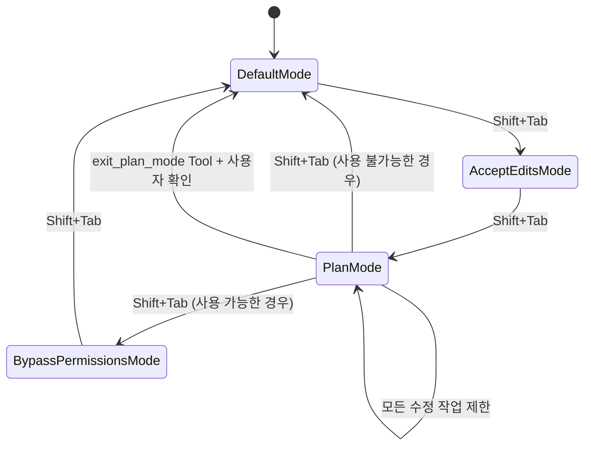
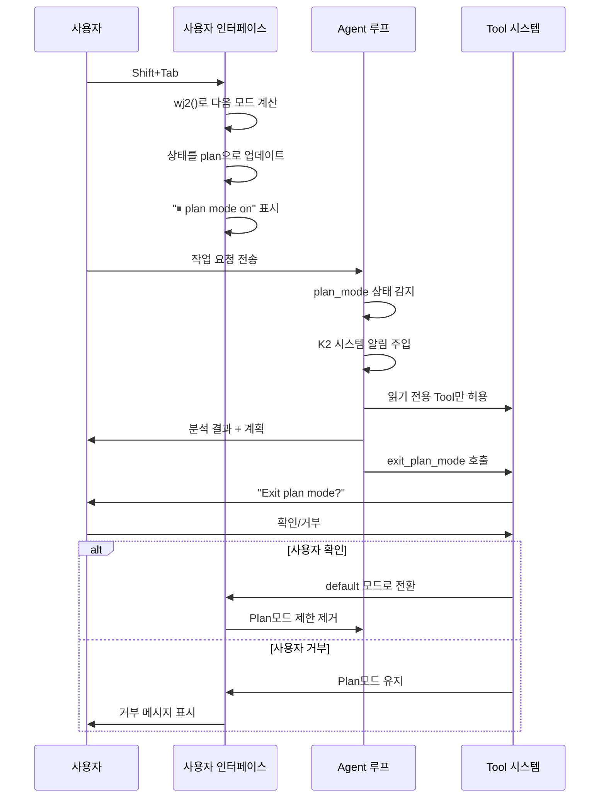

# Claude Code Plan모드 완전한 메커니즘 심층 분석

## 요약

Claude Code의 난독화된 소스 코드에 대한 심층 역공학 분석을 기반으로, 본 문서는 Plan모드의 완전한 구현 메커니즘을 상세히 분석합니다. Plan모드는 Claude Code의 핵심 보안 기능 중 하나로, 엄격한 실행 제한과 사용자 확인 절차를 통해 AI가 복잡한 작업을 실행하기 전에 반드시 계획을 수립하고 사용자 동의를 얻도록 합니다.

## 1. Plan모드 활성화 메커니즘

### 1.1 모드 전환 진입점

**주요 활성화 방식**:
- **단축키 전환**: `Shift + Tab` 키로 모드 순환 전환
- **위치**: `chunks.100.mjs:2628-2636`

```javascript
if (d0.tab && d0.shift) {
  let L9 = wj2(Q);
  if (E1("tengu_mode_cycle", {
      to: L9
    }), I({
      ...Q,
      mode: L9
    }), t) B1(!1);
  return
}
```

### 1.2 모드 순환 함수

**핵심 순환 로직**: `chunks.100.mjs:1320-1331`

```javascript
function wj2(A) {
  switch (A.mode) {
    case "default":
      return "acceptEdits";
    case "acceptEdits":
      return "plan";
    case "plan":
      return A.isBypassPermissionsModeAvailable ? "bypassPermissions" : "default";
    case "bypassPermissions":
      return "default"
  }
}
```

**모드 순환 순서**:
1. `default` → `acceptEdits`
2. `acceptEdits` → `plan`
3. `plan` → `bypassPermissions` (사용 가능한 경우) / `default`
4. `bypassPermissions` → `default`

### 1.3 모드 상태 관리

**상태 식별자**:
- Plan모드는 `mode: "plan"` 상태로 식별
- 상태는 전역 애플리케이션 상태에 저장
- 세션 수준 지속성 지원

**이벤트 추적**: `chunks.100.mjs:2630-2631`
```javascript
E1("tengu_mode_cycle", {
  to: L9
})
```

## 2. Plan모드 실행 제한 메커니즘

### 2.1 시스템 알림 주입

**제한 규칙 주입**: `chunks.93.mjs:711-717`

```javascript
case "plan_mode":
  return [K2({
    content: `<system-reminder>Plan mode is active. The user indicated that they do not want you to execute yet -- you MUST NOT make any edits, run any non-readonly tools (including changing configs or making commits), or otherwise make any changes to the system. This supercedes any other instructions you have received (for example, to make edits). Instead, you should:
1. Answer the user's query comprehensively
2. When you're done researching, present your plan by calling the ${hO.name} tool, which will prompt the user to confirm the plan. Do NOT make any file changes or run any tools that modify the system state in any way until the user has confirmed the plan.</system-reminder>`,
    isMeta: !0
  })]
```

### 2.2 엄격한 작업 제한

**금지 작업 목록**:
1. **파일 편집**: 모든 파일 수정 작업 금지
2. **설정 변경**: 시스템 설정 수정 금지
3. **코드 커밋**: Git 커밋 작업 금지
4. **비읽기 전용 Tool**: 시스템 상태를 수정하는 Tool 실행 금지
5. **시스템 상태 변경**: 시스템 상태에 영향을 주는 모든 작업 금지

**허용 작업**:
- 파일 읽기 및 분석
- 코드 검색 및 조회
- 읽기 전용 정보 수집
- 계획 수립 및 표시

### 2.3 제한 실행의 기술적 구현

**시스템 수준 제한**:
- `<system-reminder>` 태그를 통해 제한 규칙 주입
- `isMeta: !0`를 사용하여 메타 정보로 표시
- 다른 지시사항보다 높은 우선순위 ("This supercedes any other instructions")

**함수 호출 위치**: `chunks.93.mjs:712`
- Agent 루프의 시스템 알림 생성 단계에서 실행
- `K2` 함수를 통해 시스템 알림 내용 래핑

## 3. exit_plan_mode Tool 심층 분석

### 3.1 Tool 정의 및 식별

**Tool 이름 정의**: `chunks.92.mjs:3242`
```javascript
tZ5 = "exit_plan_mode"
```

**입력 Schema 정의**: `chunks.92.mjs:3244-3246`
```javascript
eZ5 = n.strictObject({
  plan: n.string().describe("The plan you came up with, that you want to run by the user for approval. Supports markdown. The plan should be pretty concise.")
})
```

**Tool 프롬프트 내용**: `chunks.92.mjs:3234-3240`
```javascript
_w2 = `Use this tool when you are in plan mode and have finished presenting your plan and are ready to code. This will prompt the user to exit plan mode.
IMPORTANT: Only use this tool when the task requires planning the implementation steps of a task that requires writing code. For research tasks where you're gathering information, searching files, reading files or in general trying to understand the codebase - do NOT use this tool.

Eg.
1. Initial task: "Search for and understand the implementation of vim mode in the codebase" - Do not use the exit plan mode tool because you are not planning the implementation steps of a task.
2. Initial task: "Help me implement yank mode for vim" - Use the exit plan mode tool after you have finished planning the implementation steps of the task.
`
```

**사용 시나리오 구분**:
- **적용**: 코드 작성이 필요한 구현 작업 계획
- **비적용**: 정보 수집, 파일 검색, 코드 이해 등 연구 작업

### 3.2 Tool 완전한 구현

**Tool 객체 정의**: `chunks.93.mjs:3-100`

```javascript
hO = {
  name: tZ5,
  async description() {
    return "Prompts the user to exit plan mode and start coding"
  },
  async prompt() {
    return _w2  // Tool 프롬프트 내용
  },
  inputSchema: eZ5,
  userFacingName() {
    return ""
  },
  isEnabled() {
    return !0
  },
  canBypassReadOnlyMode() {
    return !0
  },
  async checkPermissions(A) {
    return {
      behavior: "ask",
      message: "Exit plan mode?",
      updatedInput: A
    }
  },
  async * call({plan: A}, B) {
    let Q = B.agentId !== y9();
    yield {
      type: "result",
      data: {
        plan: A,
        isAgent: Q
      }
    }
  }
}
```

### 3.3 사용자 확인 절차

**권한 검사**: `chunks.93.mjs:24-30`
```javascript
async checkPermissions(A) {
  return {
    behavior: "ask",
    message: "Exit plan mode?",
    updatedInput: A
  }
}
```

**확인 동작**:
1. **ask 동작**: 사용자에게 명시적 확인 요청
2. **메시지 프롬프트**: "Exit plan mode?" 표시
3. **입력 유지**: 원본 입력 내용 보존

### 3.4 Agent 신원 검증 메커니즘

**Agent 신원 검증**: `chunks.93.mjs:77-83`
```javascript
async * call({plan: A}, B) {
  let Q = B.agentId !== y9();
  yield {
    type: "result",
    data: {
      plan: A,
      isAgent: Q
    }
  }
}
```

**신원 검증 메커니즘**:
- `B.agentId !== y9()`를 통해 호출자 신원 확인
- `isAgent` 마커로 Agent 시스템에서 온 것인지 구분
- 후속 결과 처리 및 UI 표시에 영향

**Agent 특별 처리**: `chunks.93.mjs:86-93`
```javascript
mapToolResultToToolResultBlockParam({
  isAgent: A
}, B) {
  if (A) return {
    type: "tool_result",
    content: 'User has approved the plan. There is nothing else needed from you now. Please respond with "ok"',
    tool_use_id: B
  }
}
```

**Agent 모드에서의 응답**:
- Agent 호출이 감지되면 특별한 확인 메시지 반환
- Agent에게 추가 작업이 필요 없으며 "ok"로 응답하라고 지시
- Agent와 사용자 간의 상호작용 절차 간소화

**완전한 응답 매핑**: `chunks.93.mjs:86-99`
```javascript
mapToolResultToToolResultBlockParam({isAgent: A}, B) {
  if (A) return {
    type: "tool_result",
    content: 'User has approved the plan. There is nothing else needed from you now. Please respond with "ok"',
    tool_use_id: B
  };
  return {
    type: "tool_result",
    content: "User has approved your plan. You can now start coding. Start with updating your todo list if applicable",
    tool_use_id: B
  }
}
```

**응답 내용 구분**:
- **Agent 호출**: 간결한 확인 메시지, "ok" 응답 요청
- **직접 호출**: 상세한 안내 메시지, todo list 업데이트 제안

**Tool 특별 속성**: `chunks.93.mjs:15-23`
```javascript
isEnabled() {
  return !0
},
isConcurrencySafe() {
  return !0
},
isReadOnly() {
  return !0
}
```

**보안 설계 요점**:
- **읽기 전용 속성**: Tool 자체는 시스템 상태를 수정하지 않음
- **동시성 안전**: 여러 인스턴스가 동시에 실행 가능
- **항상 사용 가능**: 다른 조건의 제한을 받지 않음

### 3.5 계획 표시 및 결과 처리

**플랫폼별 아이콘**: `chunks.92.mjs:3232`
```javascript
FE = mA.platform === "darwin" ? "⏺" : "●"
```

**성공 확인 렌더링**: `chunks.93.mjs:37-52`
```javascript
renderToolResultMessage({
  plan: A
}, {
  theme: Q
}) {
  return P3.createElement(w0, null, P3.createElement(h, {
    flexDirection: "column",
    marginTop: 1
  }, P3.createElement(h, {
    flexDirection: "row"
  }, P3.createElement(P, {
    color: "planMode"
  }, FE), P3.createElement(P, null, "User approved Claude's plan:")), P3.createElement(w0, null, P3.createElement(P, {
    color: "secondaryText"
  }, kK(A, Q)))))
}
```

**거부 확인 렌더링**: `chunks.93.mjs:53-70`
```javascript
renderToolUseRejectedMessage({
  plan: A
}, {
  theme: B
}) {
  return P3.createElement(w0, null, P3.createElement(h, {
    flexDirection: "column"
  }, P3.createElement(P, {
    color: "error"
  }, "User rejected Claude's plan:"), P3.createElement(h, {
    borderStyle: "round",
    borderColor: "planMode",
    borderDimColor: !0,
    paddingX: 1
  }, P3.createElement(P, {
    color: "secondaryText"
  }, kK(A, B)))))
}
```

## 4. Plan모드 UI 표현 메커니즘

### 4.1 시각적 인디케이터

**상태 표시줄 표시**: `chunks.100.mjs:1397-1403`
```javascript
if (B?.mode === "plan") return c4.createElement(P, {
  color: "planMode",
  key: "plan-mode"
}, "⏸ plan mode on", c4.createElement(P, {
  color: "secondaryText",
  dimColor: !0
}, " ", "(shift+tab to cycle)"));
```

**시각적 요소**:
- **일시정지 아이콘**: `⏸`로 실행 일시정지 상태 표시
- **상태 텍스트**: `plan mode on`으로 현재 모드 명확히 표시
- **작업 안내**: `(shift+tab to cycle)`로 사용자에게 전환 방법 안내
- **색상 테마**: `planMode` 전용 색상 사용

### 4.2 사용자 프롬프트 시스템

**모드 전환 프롬프트**: `chunks.101.mjs:2019-2023`
```javascript
{
  id: "shift-tab",
  content: "Hit shift+tab to cycle between default mode, auto-accept edit mode, and plan mode",
  cooldownSessions: 20,
  isRelevant: () => !0
}
```

**프롬프트 특징**:
- **트리거 조건**: 항상 관련성 있음 (`isRelevant: () => !0`)
- **쿨다운 시간**: 20개 세션
- **내용 설명**: 세 가지 모드의 전환 방식을 상세히 설명

### 4.3 테마 및 스타일 시스템

**색상 정의**:
- `planMode`: Plan모드 전용 색상
- `secondaryText`: 보조 텍스트 색상
- `error`: 오류 상태 색상

**레이아웃 컴포넌트**:
- `P`: 텍스트 컴포넌트
- `h`: 컨테이너 컴포넌트
- `w0`: 래퍼 컴포넌트

## 5. Plan 내용 관리 메커니즘

### 5.1 계획 내용 구조

**데이터 구조**:
```javascript
{
  plan: string,  // Markdown 형식의 계획 내용
  isAgent: boolean  // Agent에서 온 것인지 여부
}
```

**내용 요구사항**:
- **형식 지원**: Markdown 형식 지원
- **길이 제어**: 계획 내용이 간결해야 함 ("pretty concise")
- **구조화**: Markdown을 통해 구조화된 표시 지원

### 5.2 계획 검증 메커니즘

**Schema 검증**: `chunks.92.mjs:3244-3246`
```javascript
eZ5 = n.strictObject({
  plan: n.string().describe("The plan you came up with, that you want to run by the user for approval. Supports markdown. The plan should be pretty concise.")
})
```

**검증 규칙**:
- **타입 검사**: 문자열 타입이어야 함
- **비어 있지 않음 검증**: 빈 계획 허용 안 됨
- **형식 검증**: Markdown 구문 지원

### 5.3 계획 표시 포맷팅

**포맷팅 함수**: `kK(A, Q)` - 계획 내용을 포맷팅하여 표시
- **매개변수 A**: 계획 내용
- **매개변수 Q**: 테마 설정
- **반환**: 포맷팅된 React 요소

**표시 효과**:
- Markdown 렌더링 지원
- 테마 스타일 적용
- 반응형 레이아웃

## 6. Plan모드와 Agent 루프 통합

### 6.1 시스템 알림 주입 지점

**주입 위치**: Agent 루프의 시스템 알림 생성 단계
**주입 함수**: `K2` - 시스템 알림 래핑 함수
**트리거 조건**: `plan_mode` 상태가 감지될 때 자동 주입

### 6.2 모드 상태 전달

**상태 흐름**:
```
사용자 전환 → 상태 업데이트 → Agent 루프 감지 → 시스템 알림 주입 → AI 동작 제한
```

**감지 메커니즘**:
```javascript
case "plan_mode":
  return [K2({...})]
```

### 6.3 컨텍스트 관리

**컨텍스트 주입**:
- Plan모드 제한 규칙이 시스템 수준 컨텍스트로 사용
- 사용자 지시사항보다 높은 우선순위
- 모드 전환 시까지 지속적으로 유효

**컨텍스트 내용**:
- 작업 금지 사항 설명
- 허용되는 작업 범위
- 종료 절차 안내

## 7. 보안 메커니즘 및 경계 강제

### 7.1 다층 보안 제어

**첫 번째 계층 - 시스템 알림**:
- Agent 루프 시작 시 제한 규칙 주입
- 최고 우선순위의 시스템 지시사항 사용

**두 번째 계층 - Tool 권한**:
- `canBypassReadOnlyMode`를 통해 Tool 사용 가능성 제어
- Plan모드에서 실행 가능한 특정 Tool만 허용

**세 번째 계층 - 사용자 확인**:
- Plan모드를 종료하려면 사용자 확인 필수
- 계획의 명확한 표시 및 검토 지원

### 7.2 경계 강제 구현

**기술적 수단**:
1. **지시사항 우선순위**: 시스템 알림이 사용자 지시사항보다 높은 우선순위
2. **Tool 제한**: 읽기 전용 Tool만 실행 허용
3. **상태 검사**: 작업 전에 현재 모드 확인
4. **사용자 제어**: 사용자가 모드 전환을 완전히 제어

**보호 범위**:
- 파일 시스템 수정
- 시스템 설정 변경
- 외부 명령 실행
- 상태 지속성 작업

## 8. 구현 세부사항 및 기술 요점

### 8.1 주요 함수 매핑

| 기능 모듈 | 함수명 | 파일 위치 | 기능 설명 |
|---------|--------|----------|----------|
| 모드 전환 감지 | `d0.tab && d0.shift` | chunks.100.mjs:2628 | Shift+Tab 키 조합 감지 |
| 모드 순환 로직 | `wj2(A)` | chunks.100.mjs:1320 | 모드 순환 전환 함수 |
| 시스템 알림 주입 | `K2({...})` | chunks.93.mjs:712 | Plan모드 제한 주입 |
| 종료 Tool 정의 | `hO` | chunks.93.mjs:3 | exit_plan_mode Tool 구현 |
| UI 상태 표시 | `B?.mode === "plan"` | chunks.100.mjs:1397 | Plan모드 UI 인디케이터 |
| 이벤트 추적 | `E1("tengu_mode_cycle")` | chunks.100.mjs:2630 | 모드 전환 이벤트 기록 |

### 8.2 상태 머신 설계



### 8.3 데이터 흐름 분석



## 9. 오류 처리 및 예외 상황

### 9.1 모드 전환 실패

**처리 메커니즘**:
- 현재 모드 상태 유지
- 오류 이벤트 기록
- 사용자 친화적인 오류 메시지 표시

### 9.2 권한 검증 실패

**처리 전략**:
- 작업 실행 차단
- 사용자에게 권한 부족 알림
- 올바른 작업 방법 제안

### 9.3 시스템 알림 주입 실패

**내결함성 메커니즘**:
- 읽기 전용 모드로 다운그레이드
- 시스템 오류 로그 기록
- 사용자에게 시스템 상태 이상 알림

## 10. 성능 최적화 및 리소스 관리

### 10.1 이벤트 처리 최적화

**키보드 이벤트**:
- 이벤트 위임을 사용하여 리스너 수 감소
- 디바운스 처리로 빈번한 모드 전환 방지
- 빠른 모드 상태 감지

### 10.2 상태 관리 최적화

**메모리 사용**:
- 경량 상태 객체
- 깊은 상태 복사 방지
- 사용하지 않는 상태 적시 정리

### 10.3 UI 렌더링 최적화

**렌더링 전략**:
- 조건부 렌더링으로 DOM 작업 감소
- 긴 목록 내용 가상화
- 스타일 캐싱 및 재사용

## 11. 테스트 및 검증 전략

### 11.1 기능 테스트 요점

1. **모드 전환 테스트**:
   - Shift+Tab 순환 전환
   - 상태 UI 올바른 표시
   - 이벤트 올바른 추적

2. **제한 메커니즘 테스트**:
   - 편집 작업 차단됨
   - 시스템 알림 올바른 주입
   - 읽기 전용 작업 정상 실행

3. **종료 절차 테스트**:
   - 계획 올바른 표시
   - 사용자 확인 절차
   - 모드 올바른 전환

### 11.2 보안 테스트 요점

1. **제한 우회 테스트**:
   - 편집 Tool 직접 호출 시도
   - 시스템 알림의 포괄성 테스트
   - 우선순위 메커니즘 검증

2. **경계 조건 테스트**:
   - 비정상 입력 처리
   - 네트워크 중단 상황
   - 시스템 리소스 부족

## 12. 요약 및 기술적 통찰

### 12.1 설계 장점

1. **보안 우선**: 다층 보안 메커니즘으로 사용자가 완전히 제어
2. **사용자 친화적**: 직관적인 UI 인디케이터 및 작업 절차
3. **기술적 엄격성**: 완전한 상태 관리 및 오류 처리
4. **확장성 우수**: 모듈화된 설계로 기능 확장 용이

### 12.2 구현 하이라이트

1. **시스템 수준 제한**: Agent 루프의 시스템 알림을 통해 최고 우선순위의 작업 제한 구현
2. **사용자 확인 메커니즘**: AI 실행 계획에 대한 사용자 검토 및 확인 강제
3. **상태 시각화**: 명확한 UI 인디케이터로 사용자가 현재 모드를 항상 파악
4. **빠른 작업**: Shift+Tab의 빠른 모드 전환으로 사용자 경험 향상

### 12.3 기술 혁신

1. **난독화된 코드의 명확한 로직**: 고도로 난독화된 코드에서도 Plan모드의 구현 로직은 명확하게 추적 가능
2. **React 컴포넌트의 깊은 통합**: UI 상태와 핵심 로직의 긴밀한 통합
3. **이벤트 주도 아키텍처**: 이벤트 시스템을 통해 느슨하게 결합된 모드 관리 구현
4. **Agent 신원 구분**: `agentId` 검증을 통해 다른 호출 소스의 차별화된 처리 구현
5. **플랫폼 적응**: 운영 체제 플랫폼에 따라 적절한 UI 아이콘 선택
6. **권한 계층화**: `canBypassReadOnlyMode`를 통해 세밀한 권한 제어 구현

### 12.4 완전한 워크플로우 요약

```mermaid
graph TB
    A[사용자가 Shift+Tab 누름] --> B[wj2()로 다음 모드 계산]
    B --> C{현재 모드}
    C -->|default| D[acceptEdits로 전환]
    C -->|acceptEdits| E[plan으로 전환]
    C -->|plan| F{bypassPermissions 있는가}
    F -->|예| G[bypassPermissions로 전환]
    F -->|아니오| H[default로 전환]
    C -->|bypassPermissions| H

    E --> I[⏸ plan mode on 표시]
    I --> J[사용자가 작업 시작]
    J --> K[Agent 루프가 plan_mode 감지]
    K --> L[K2 시스템 알림 주입]
    L --> M[모든 수정 작업 제한]
    M --> N[AI가 분석하고 계획 수립]
    N --> O[exit_plan_mode Tool 호출]
    O --> P{사용자 확인?}
    P -->|확인| Q[default 모드로 전환]
    P -->|거부| R[plan 모드 유지]
    Q --> S[모든 제한 제거]
    R --> I
```

Plan모드의 구현은 Claude Code가 AI 보안성과 사용자 제어 측면에서 깊이 있게 고려했음을 보여주며, 기술적 수단을 통해 AI 어시스턴트가 복잡한 작업을 실행할 때 반드시 사용자의 명시적 승인을 얻도록 보장합니다. 이러한 설계 철학은 다른 AI 애플리케이션이 참고하고 학습할 가치가 있습니다.

## 13. 기술 구현의 심층 통찰

### 13.1 보안 아키텍처의 다층 방어

Plan모드의 보안 구현은 **심층 방어** 전략을 채택합니다:

1. **UI 계층 방어**: 시각적 인디케이터를 통해 사용자에게 현재 제한 모드임을 명확히 알림
2. **입력 계층 차단**: 단축키 제어로 모드 전환, 실수로 인한 활성화 방지
3. **로직 계층 제한**: Agent 루프에서 시스템 알림을 통해 강제적 제한 규칙 주입
4. **Tool 계층 제어**: 읽기 전용 Tool만 실행 허용, 모든 수정성 작업 차단
5. **확인 계층 검증**: 제한 모드를 종료하려면 사용자가 명시적으로 확인해야 함

### 13.2 상태 관리의 원자성 보장

모드 전환 구현은 **원자성 작업**을 보장합니다:
- 상태 검사, 업데이트, UI 피드백이 단일 이벤트 루프에서 완료
- `wj2()` 함수의 결정론적 로직으로 상태 불일치 방지
- 이벤트 추적 `E1("tengu_mode_cycle")`으로 상태 변경의 감사 가능성 제공

### 13.3 사용자 경험과 보안의 균형

Plan모드는 보안성과 사용성 사이에서 교묘한 균형을 찾았습니다:
- **단일 키 전환**: Shift+Tab의 빠른 모드 전환으로 사용 장벽 낮춤
- **명확한 피드백**: ⏸ 아이콘과 텍스트 프롬프트로 사용자가 현재 상태를 항상 파악
- **점진적 확인**: 모드 전환에서 계획 확인까지 2단계 검증 절차
- **지능형 구분**: 작업 성격에 따라 종료 Tool 사용 여부 자동 판단

### 13.4 확장성 설계의 선견지명

모드 순환 함수 `wj2()`의 설계는 우수한 확장성을 보여줍니다:
- 순환에 새 모드를 동적으로 추가 지원
- `isBypassPermissionsModeAvailable`을 통해 조건부 모드 구현
- 미래의 권한 계층화 및 역할 관리 요구를 위한 공간 확보

이러한 설계로 Claude Code는 간결성을 유지하면서도 복잡한 엔터프라이즈 수준의 권한 관리 요구를 위한 기본 지원을 제공할 수 있습니다.

## 부록: 핵심 코드 조각 완전한 색인

### A.1 모드 전환 핵심 코드
- **파일**: chunks.100.mjs
- **행 번호**: 2628-2636, 1320-1331
- **기능**: Shift+Tab 감지 및 모드 순환

### A.2 시스템 알림 주입 코드
- **파일**: chunks.93.mjs
- **행 번호**: 711-717
- **기능**: Plan모드 제한 규칙 주입

### A.3 exit_plan_mode Tool 코드
- **파일**: chunks.93.mjs, chunks.92.mjs
- **행 번호**: 3-100, 3242-3246
- **기능**: 계획 확인 및 모드 종료

### A.4 UI 인디케이터 코드
- **파일**: chunks.100.mjs
- **행 번호**: 1397-1403
- **기능**: Plan모드 시각적 인디케이터

이러한 코드 조각들이 Plan모드의 완전한 구현 기반을 구성하며, 협업을 통해 안전하고 제어 가능하며 사용자 친화적인 AI 계획 실행 메커니즘을 구현합니다.
